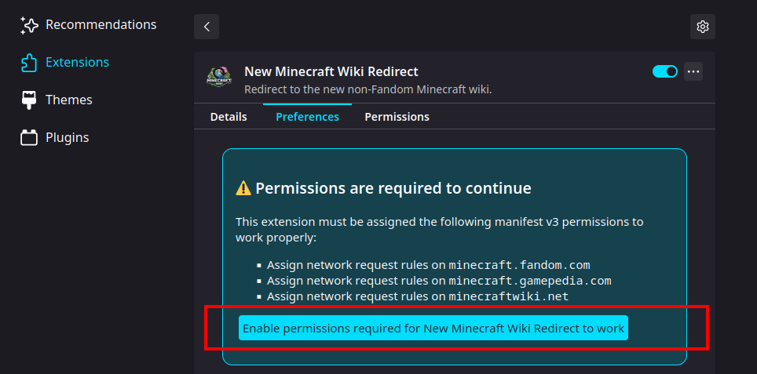

New Minecraft Wiki Redirect
===========================

[Firefox extension](https://addons.mozilla.org/en-US/firefox/addon/new-minecraft-wiki-redirect/)

This extension will redirect the Fandom Minecraft wiki to <https://minecraft.wiki>

It contains no surprises, no data collection, no third party assets, and uses the minimal set of manifest v3 permissions. Unlike userscript-based alternatives, this uses the declarative net requests APIs to redirect the page before an HTTP request to Fandom is sent, so CPU time isn't wasted loading the original page.

### Redirected domains

This extension redirects the following domains:

- `minecraft.fandom.com`
- `minecraft.gamepedia.com`
- `minecraftwiki.net`

Usage instructions
------------------

To get started, enable permissions for this extension by clicking the button above.

Click `Allow`

### Toggling redirection

You may wish to temporarily disable the redirection. To do so, you can click the browser action button for the extension. To show it on the toolbar, click `Extensions`, click the gear icon next to the extension, and check `Pin to Toolbar`:

Then click on it to toggle between on and off. When the `X` is shown, redirection is turned off.

License
-------

Copyright © lordpipe 2023

This program is free software: you can redistribute it and/or modify it under the terms of the GNU General Public License as published by the Free Software Foundation, either version 3 of the License, or (at your option) any later version.

This program is distributed in the hope that it will be useful, but WITHOUT ANY WARRANTY; without even the implied warranty of MERCHANTABILITY or FITNESS FOR A PARTICULAR PURPOSE. See the GNU General Public License for more details.

You should have received a copy of the GNU General Public License along with this program. If not, see <<https://www.gnu.org/licenses/>>.
